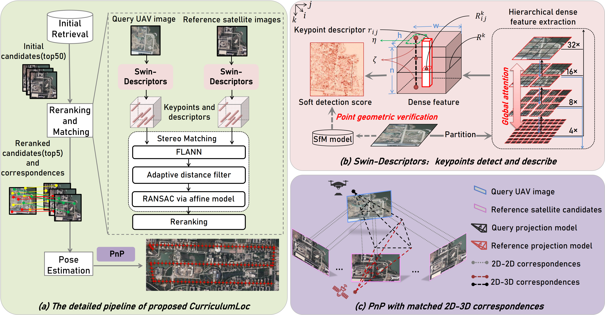

# CurriculumLoc for Visual Geo-localization



## Introduction
CurriculumLoc is a PyTorch implementation for our paper ["CurriculumLoc: Enhancing Cross-Domain Geolocalization through Multi-Stage Refinement"](https://arxiv.org/abs/2311.11604). If you use this code for your research, please cite our paper. For additional questions contact us via huboni@mail.nwpu.edu.cn or huboni7@gmail.com.


## Installation

We test this repo with Python 3.10, PyTorch 1.12.1, and CUDA 11.3. However, it should be runnable with recent PyTorch versions. You can install by conda with our prove environment.taml.

```shell
conda env create -f environment.yaml
```


## Preparation

We test our models on two datasets. One dataset is [ALTO](https://github.com/MetaSLAM/ALTO), it can be download at [here](https://github.com/MetaSLAM/ALTO). Another is our TerraTrack, TerraTrack is being prepared....  All of these datasets contain some challenging environmental variations, as shown in below table.


## Training

```
python train_terra.py
```


## Testing

```
python match_localization.py 
```


## Citation

If you're using CurculumLoc in your research or applications, please cite using this BibTeX:

```bibtex
@misc{hu2023curriculumloc,
      title={CurriculumLoc: Enhancing Cross-Domain Geolocalization through Multi-Stage Refinement}, 
      author={Boni Hu and Lin Chen and Runjian Chen and Shuhui Bu and Pengcheng Han and Haowei Li},
      year={2023},
      eprint={2311.11604},
      archivePrefix={arXiv},
      primaryClass={cs.CV}
}
```

